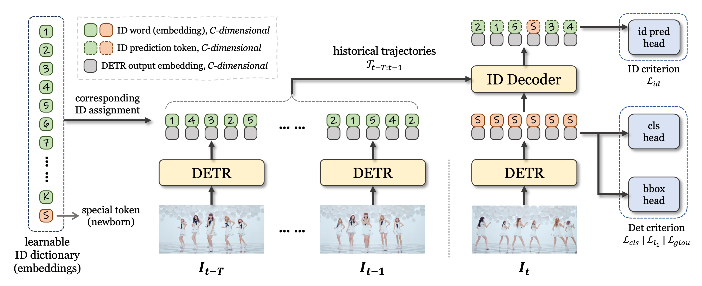

# Multiple Object Tracking as ID Prediction

This is the official PyTorch implementation of our paper:

> ***[Multiple Object Tracking as ID Prediction](https://arxiv.org/abs/2403.16848)***  
> [Ruopeng Gao](https://ruopenggao.com/), Yijun Zhang, [Limin Wang](https://wanglimin.github.io/)

## Overview

**TL; DR.** MOTIP proposes a new perspective to regard the multi-object tracking task as an ID prediction problem. 
It directly predicts the ID labels for each object in the tracking process, which is more straightforward and effective.

**Abstract.** In Multiple Object Tracking (MOT), tracking-by-detection methods have stood the test for a long time, which split the process into two parts according to the definition: object detection and association. They leverage robust single-frame detectors and treat object association as a post-processing step through hand-crafted heuristic algorithms and surrogate tasks. However, the nature of heuristic techniques prevents end-to-end exploitation of training data, leading to increasingly cumbersome and challenging manual modification while facing complicated or novel scenarios. In this paper, we regard this object association task as an End-to-End in-context ID prediction problem and propose a streamlined baseline called MOTIP. Specifically, we form the target embeddings into historical trajectory information while considering the corresponding IDs as in-context prompts, then directly predict the ID labels for the objects in the current frame. Thanks to this end-to-end process, MOTIP can learn tracking capabilities straight from training data, freeing itself from burdensome hand-crafted algorithms. Without bells and whistles, our method achieves impressive state-of-the-art performance in complex scenarios like DanceTrack and SportsMOT, and it performs competitively with other transformer-based methods on MOT17. We believe that MOTIP demonstrates remarkable potential and can serve as a starting point for future research.

## Main Results

### DanceTrack

| Method              | Training Data | HOTA | DetA | AssA | MOTA | IDF1 |
| ------------------- | ------------- | ---- | ---- | ---- | ---- | ---- |
| MOTIP               | DT            | 67.5 | 79.4 | 57.6 | 90.3 | 72.2 |
| MOTIPDAB | DT            | 70.0 | 80.8 | 60.8 | 91.0 | 75.1 |
| MOTIP               | DT + CH       | 71.4 | 81.3 | 62.8 | 91.6 | 76.3 |

  
<i>NOTE</i>

  <ol>
    <li>MOTIP is built upon original Deformable DETR, while MOTIPDAB is based on DAB-Deformable DETR.</li>
    <li>DT and CH are the abbreviations of DanceTrack and CrowdHuman respectively.</li>
  </ol>

### SportsMOT

| Method | Training Data | HOTA | DetA | AssA | MOTA | IDF1 |
| ------ | ------------- | ---- | ---- | ---- | ---- | ---- |
| MOTIP  | Sports        | 71.9 | 83.4 | 62.0 | 92.9 | 75.0 |

  
<i>NOTE</i>

  <ol>
    <li>Sports is the abbreviation of SportsMOT.</li>
  </ol>

### MOT17

| Method | Training Data | HOTA | DetA | AssA | MOTA | IDF1 |
| ------ | ------------- | ---- | ---- | ---- | ---- | ---- |
| MOTIP  | MOT17 + CH    | 59.2 | 62.0 | 56.9 | 75.5 | 71.2 |

  
<i>NOTE</i>

  <ol>
    <li>CH is the abbreviation of CrowdHuman.</li>
  </ol>

